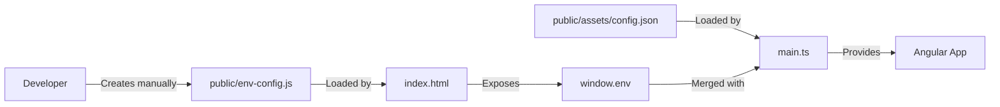
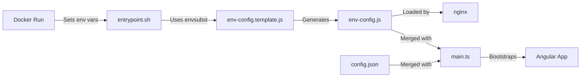
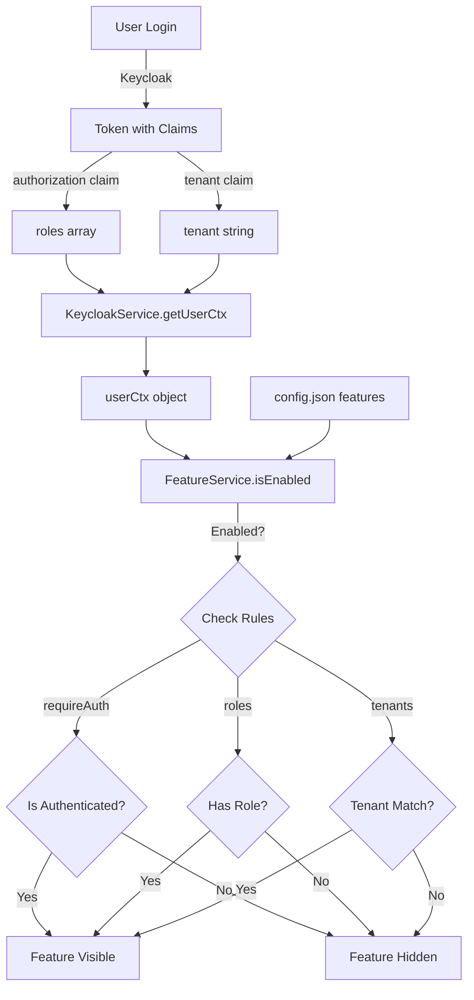

# Angular 19+ Skeleton
>_Last updated: 2025-12-23_

> 🚀 Modern Angular 19+ project template with runtime environment configs, standalone components, NgRx state management, dynamic forms, internationalization, and full CI/CD support.

---

## 📋 Table of Contents

- [Quick Start](#-quick-start-for-developers)
- [Runtime Configuration Architecture](#-runtime-configuration-architecture)
- [Feature Flags & Tenant Resolution](#-feature-flags--tenant-resolution)
- [Keycloak Setup](#-keycloak-prerequisites)
- [Using Core SDK](#-using-the-core-sdk)
- [Development & Build](#️-development--build)
- [Project Structure](#-project-structure)
- [Documentation Index](#-documentation-index)

---

## 🧭 Quick Start for Developers

### Initial Setup

1. **Configure npm registry access:**
   ```bash
   npx vsts-npm-auth -config .npmrc
   ```

2. **Install dependencies:**
   ```bash
   npm install
   ```

3. **Set up local runtime configuration:**
   ```bash
   # Copy the template
   cp public/env-config.template.js public/env-config.js
   
   # Edit with your local values
   # public/env-config.js should look like:
   window.env = {
     API_URL: "/api",
     KEYCLOAK_URL: "https://keycloak-dev.example.com/",
     KEYCLOAK_REALM:"genai-dev",
     KEYCLOAK_CLIENT_ID:"genai-app"
   };
   ```

4. **Configure Keycloak client** (Public + PKCE S256) and brokered IdPs if needed

5. **Start development server:**
   ```bash
   npm start
   ```

6. **Verify setup:**
   - App redirects to Keycloak and back
   - API calls include Bearer token
   - Check browser console: `console.log(window.env)`

### Environment URLs (Reference)

**Development:**
```javascript
// Keycloak
AUTHORIZATION_URL: https://keycloak.pxl-codit.com/realms/genai-dev/protocol/openid-connect/auth
ACCESS_TOKEN_URL: https://keycloak.pxl-codit.com/realms/genai-dev/protocol/openid-connect/token
CLIENT_ID: genai-app
REDIRECT_URL: https://app.pxl-codit.com/

// Backend
API_URL: https://app.pxl-codit.com/api
SWAGGER: https://app.pxl-codit.com/api/doc/
```

---

## 🔧 Runtime Configuration Architecture

### Why This Approach?

This application uses a **hybrid configuration strategy** that enables:

- ✅ **Single Docker image** for all environments (dev, UAT, prod)
- ✅ **No rebuild required** when changing API URLs or Keycloak endpoints
- ✅ **Environment-specific values** injected at container startup
- ✅ **Static feature flags** defined once at build time

### File Structure & Purpose

```
public/
├── env-config.template.js    ← Template with ${PLACEHOLDERS} (committed to Git)
├── env-config.js             ← Generated at runtime (gitignored, local dev only)
└── assets/
    └── config.json           ← Static app configuration (feature flags, menu structure)

docker/
└── entrypoint.sh             ← Generates env-config.js at container startup

nginx/
└── default.conf.template     ← Nginx config template with dynamic CSP headers
```

| File | Purpose | When Created | Contains |
|------|---------|--------------|----------|
| **`env-config.template.js`** | Template for runtime config | Development (committed) | Placeholders like `${API_URL}` |
| **`env-config.js`** | Actual runtime config | Container startup or local dev | Real values from env vars |
| **`config.json`** | Static app config | Build time | Feature flags, menu structure, auth settings |

---

### How It Works

#### 🏠 Development (Local)



**Steps:**
1. Developer copies `env-config.template.js` → `env-config.js`
2. Edits with real local values:
   ```javascript
   window.env = {
     API_URL: "https://app-dev.example.com/api",
     KEYCLOAK_URL: "https://keycloak-dev.example.com/",
     KEYCLOAK_REALM:"genai-dev",
     KEYCLOAK_CLIENT_ID:"genai-app"
   };
   ```
3. Angular loads this file in `index.html`:
   ```html
   <script src="/env-config.js"></script>
   ```
4. `main.ts` merges `window.env` with `config.json` before bootstrap

#### 🐳 Production (Docker)



**Build time:**
```bash
npm run buildProd  # Always production build (no environment-specific builds)
docker build -t psx-ng-skeleton:latest .
```

**Runtime:**
```bash
docker run -d -p 80:80 \
  -e API_URL="https://api.example.com" \
  -e KEYCLOAK_URL="https://keycloak.example.com/" \
  -e KEYCLOAK_REALM="genai-dev" \
  -e KEYCLOAK_CLIENT_ID="genai-app" \
  -e ENVIRONMENT="production" \
  psx-ng-skeleton:latest
```

**Container startup sequence:**
1. `entrypoint.sh` reads environment variables (`API_URL`, `KEYCLOAK_URL`,`KEYCLOAK_REALM`,`KEYCLOAK_CLIENT_ID`, `ENVIRONMENT`)
2. Generates `env-config.js` from template using `envsubst`:
   ```bash
   envsubst < /usr/share/nginx/html/env-config.template.js \
            > /usr/share/nginx/html/env-config.js
   ```
3. Result:
   ```javascript
   window.env = {
     API_URL: "https://api.example.com",
     KEYCLOAK_URL: "https://keycloak.example.com/",
     KEYCLOAK_REALM: "genai-dev",
     KEYCLOAK_CLIENT_ID:"genai-app"
   };
   ```
4. Generates nginx config with dynamic CSP headers based on URLs
5. Angular loads generated file and merges with `config.json`

---

### Configuration Merge Flow

```typescript
// main.ts - Bootstrap sequence

// 1. Load static configuration (feature flags, menu structure)
const staticConfigRes = await fetch('/assets/config.json', { cache: 'no-store' });
const staticConfig = await staticConfigRes.json();

// 2. Runtime environment loaded via <script src="/env-config.js">
const runtimeEnv = window.env; // Injected by env-config.js

// 3. Merge configurations
const finalConfig = {
  ...staticConfig,
  apiUrl: runtimeEnv.API_URL,           // ← Runtime override
  auth: {
    ...staticConfig.auth,
    url: env.KEYCLOAK_URL,
    realm: env.KEYCLOAK_REALM,
    clientId: env.KEYCLOAK_CLIENT_ID,
    init: window.location.origin + '/'
  }
};

// 4. Bootstrap Angular with merged config
await bootstrapApplication(AppComponent, {
  providers: [
    provideCore({
      appVersion: pkg.version,
      environments: finalConfig,
      theme: 'light',
      i18n: { /* ... */ }
    })
  ]
});
```

---

### What Goes Where?

| Configuration Type | File | Example | When to Change |
|-------------------|------|---------|----------------|
| **Environment URLs** | `env-config.js` (runtime) | `API_URL`, `KEYCLOAK_URL`, `KEYCLOAK_REALM`, `KEYCLOAK_CLIENT_ID` | Per environment deployment |
| **Feature flags** | `config.json` (static) | `features.dashboard.enabled` | Per application release |
| **Menu structure** | `config.json` (static) | `features.dashboard.route` | Per application release |
| **Auth realm/client** | `config.json` (static) | `auth.realm`, `auth.clientId` | Per tenant setup |
| **Tenant rules** | `config.json` (static) | `features.x.allow.tenants` | Per application release |

**Rule of thumb:**
- ✅ **Changes per environment** (dev/uat/prod) → `env-config.js` (via env vars)
- ✅ **Changes per deployment** (features, UI) → `config.json` (static)

---

### Required Environment Variables

These variables **must be set** when running the Docker container:

| Variable | Example | Description |
|----------|---------|-------------|
| `API_URL` | `https://app.pxl-codit.com/api` | Backend API base URL (no trailing slash) |
| `KEYCLOAK_URL` | `https://keycloak.pxl-codit.com/` | Keycloak server URL (with trailing slash) |
| `KEYCLOAK_CLIENT_ID` | `genai-app` | Keycloak client_id |
| `KEYCLOAK_REALM` | `genai-dev/` | Keycloak realm |
| `ENVIRONMENT` | `production` | Environment name (`development`, `uat`, `production`) |

**Environment-specific behavior:**
- `development` → COOP header: `unsafe-none` (allows cross-origin for debugging)
- `uat`/`production` → COOP header: `same-origin` (strict isolation)

---

### Deployment Examples

#### Docker CLI

```bash
# Development
docker run -d -p 80:80 \
  -e API_URL="https://app-dev.example.com/api" \
  -e KEYCLOAK_URL="https://keycloak-dev.example.com/" \
  -e KEYCLOAK_REALM="genai-dev" \
  -e KEYCLOAK_CLIENT_ID="genai-app" \
  -e ENVIRONMENT="development" \
  teamhub-se.telindus.lu:5050/genai/frontend/frontend-psx-ng-skeleton:latest

# UAT (same image, different env vars!)
docker run -d -p 80:80 \
  -e API_URL="https://app-uat.example.com/api" \
  -e KEYCLOAK_URL="https://keycloak-uat.example.com/" \
  -e KEYCLOAK_REALM="genai-dev" \
  -e KEYCLOAK_CLIENT_ID="genai-app" \
  -e ENVIRONMENT="uat" \
  teamhub-se.telindus.lu:5050/genai/frontend/frontend-psx-ng-skeleton:latest

# Production (same image, different env vars!)
docker run -d -p 80:80 \
  -e API_URL="https://api.example.com" \
  -e KEYCLOAK_URL="https://keycloak.example.com/" \
  -e KEYCLOAK_REALM="genai-dev" \
  -e KEYCLOAK_CLIENT_ID="genai-app" \
  -e ENVIRONMENT="production" \
  teamhub-se.telindus.lu:5050/genai/frontend/frontend-psx-ng-skeleton:latest
```

#### Docker Compose

```yaml
version: '3.8'
services:
  psx-ng-skeleton-frontend:
    image: teamhub-se.telindus.lu:5050/genai/frontend/frontend-psx-ng-skeleton:latest
    ports:
      - "80:80"
    environment:
      - API_URL=https://app.pxl-codit.com/api
      - KEYCLOAK_URL=https://keycloak.pxl-codit.com/
      - KEYCLOAK_REALM=genai-dev
      - KEYCLOAK_CLIENT_ID=genai-app
      - ENVIRONMENT=production
```

#### Kubernetes

```yaml
apiVersion: v1
kind: ConfigMap
metadata:
  name: app-config
data:
  API_URL: "https://api.example.com"
  KEYCLOAK_URL: "https://keycloak.example.com/"
  KEYCLOAK_REALM: "genai-dev"
  KEYCLOAK_CLIENT_ID: "genai-app"
  ENVIRONMENT: "production"
---
apiVersion: apps/v1
kind: Deployment
metadata:
  name: app-frontend
spec:
  replicas: 3
  template:
    spec:
      containers:
      - name: psx-ng-skeleton
        image: teamhub-se.telindus.lu:5050/genai/frontend/frontend-psx-ng-skeleton:latest
        envFrom:
        - configMapRef:
            name: app-config
        ports:
        - containerPort: 80
```

---

### Troubleshooting Runtime Configuration

#### Issue: `window.env is undefined` in browser console

**Cause:** `env-config.js` not loaded or generated

**Solution:**
```bash
# 1. Check if file exists in container
docker exec <container-name> ls -la /usr/share/nginx/html/env-config.js

# 2. View generated content
docker exec <container-name> cat /usr/share/nginx/html/env-config.js

# 3. Verify environment variables were passed
docker inspect <container-name> | grep -A 10 Env

# 4. Check browser network tab
# Should see successful request to /env-config.js

# 5. Check browser console
console.log(window.env);
// Should output: {API_URL: "...", KEYCLOAK_URL: "...", KEYCLOAK_REAML: "...", KEYCLOAK_CLIENT_ID: "..."}
```

#### Issue: API calls go to wrong URL

**Cause:** Runtime configuration not merged correctly

**Solution:**
```typescript
// Check in browser console:
console.log(window.env);        // Should show runtime values
console.log(window.env.API_URL); // Should NOT be "${API_URL}"

// Verify merge in main.ts
const runtimeConfig = {
  ...staticConfig,
  apiUrl: window.env.API_URL,
  auth: { 
    ...staticConfig.auth, 
    url: window.env.KEYCLOAK_URL ,
    realm: window.env.KEYCLOAK_REALM,
    clientId: window.env.KEYCLOAK_CLIENT_ID,
    init: window.location.origin + '/'
  }
};
```

#### Issue: Need different CSP headers per environment

**Solution:** Set `ENVIRONMENT` variable when running container:
- `development` → Relaxed CSP for debugging
- `uat`/`production` → Strict CSP

```bash
docker run -e ENVIRONMENT="development" psx-ng-skeleton:latest  # Relaxed CSP
docker run -e ENVIRONMENT="production" psx-ng-skeleton:latest   # Strict CSP
```

#### Issue: Config change requires rebuild

**This is the old behavior!** New approach:
- ❌ No rebuild needed for URL changes
- ✅ Just restart container with new env vars:
  ```bash
  docker stop psx-ng-skeleton-container
  docker run -e API_URL="https://new-api.com" psx-ng-skeleton:latest
  ```

---

### Security Considerations

1. **Never commit `env-config.js`**
   - It's gitignored for security
   - Contains environment-specific values
   - Template file (`env-config.template.js`) is safe to commit

2. **Template contains only placeholders**
   ```javascript
   // ✅ Safe - contains placeholders
   window.env = {
     API_URL: "${API_URL}",
     KEYCLOAK_URL: "${KEYCLOAK_URL}",
     KEYCLOAK_REAML: "${KEYCLOAK_REAML}",
     KEYCLOAK_CLIENT_ID: "${KEYCLOAK_CLIENT_ID}",
   };
   ```

3. **Secrets via environment variables**
   - Never bake secrets into Docker image
   - Pass at runtime via `-e` or ConfigMap
   - Use secret management tools (Vault, Azure Key Vault)

4. **Dynamic CSP headers**
   - Generated based on runtime `API_URL` and `KEYCLOAK_URL`
   - Prevents injection attacks
   - Configurable per environment via `ENVIRONMENT` variable

---

### Benefits of This Approach

| Aspect | Old Approach | New Approach | Improvement |
|--------|-------------|--------------|-------------|
| **Builds per release** | 3 builds (dev, uat, prod) | 1 build | 🚀 3x faster CI/CD |
| **Config changes** | Rebuild + redeploy | Restart container | ⚡ Instant updates |
| **CI/CD time** | ~15 minutes | ~5 minutes | ⏱️ 10 min saved |
| **Image storage** | 3 images per version | 1 image per version | 💾 66% less storage |
| **Deployment flexibility** | Baked-in config | Runtime config | 🎯 True portability |
| **Environment promotion** | Rebuild for prod | Promote same image | ✅ What you test is what you deploy |

---

## 🎯 Feature Flags & Tenant Resolution

### Overview

> **TL;DR**  
> - `KeycloakService` builds a **`userCtx`** from the token (auth state, roles, tenant)
> - `FeatureService` compares `userCtx` against **RuntimeConfig** to decide what to show
> - `featureGuard('key')` and `visibleFeatures()` use the **same checks**, keeping navigation and menus in sync

### Key Terms

- **RuntimeConfig** (`assets/config.json`): Feature definitions with rules
  ```json
  {
    "features": {
      "dashboard": {
        "enabled": true,
        "requireAuth": true,
        "roles": ["ROLE_user", "ROLE_admin"],
        "allow": { "tenants": ["acme", "globex"] },
        "key": "dashboard",
        "label": "nav.dashboard",
        "icon": "dashboard",
        "route": "/dashboard"
      }
    }
  }
  ```

- **userCtx**: User context from Keycloak token
  ```typescript
  {
    isAuthenticated: boolean;
    roles: string[];      // From custom 'authorization' claim
    tenant: string | null; // From custom 'tenant' claim
  }
  ```

### Data Flow



1. **Auth & User Context**  
   `KeycloakService.getUserCtx()` extracts from token:
   - `isAuthenticated` (boolean)
   - `roles` (from custom `authorization` claim)
   - `tenant` (from custom `tenant` claim)

2. **Feature Evaluation**  
   `FeatureService.isEnabled(featureKey, userCtx)` checks:
   - ✅ `enabled === true`
   - ✅ if `requireAuth`, then `userCtx.isAuthenticated === true`
   - ✅ if `roles` defined, user must have at least one matching role
   - ✅ if `allow.tenants` defined, `userCtx.tenant` must be in list

3. **Menus & Guards**  
   - `FeatureService.visibleFeatures(userCtx?)` filters features for menu
   - `featureGuard('feature.key')` applies same rules to routes
     - Not authenticated + `requireAuth` → Redirects to Keycloak
     - Authenticated but forbidden → Redirects to `/403`

---

## 🔐 Keycloak Prerequisites

### Required Custom Claims

Configure these **two custom claims** in your Keycloak client (or realm) to include in the **Access Token**:

#### 1) `tenant` Claim (String)

**Mapper Configuration:**
- **Mapper Type:** *User Attribute*
- **User Attribute:** `tenant`
- **Token Claim Name:** `tenant`
- **Claim JSON Type:** `String`
- **Add to access token:** ✅
- **Add to ID token:** ✅ (optional)
- **Add to userinfo:** ✅ (optional)

**Add to user:**
```
User → Attributes → Add:
  Key: tenant
  Value: acme
```

#### 2) `authorization` Claim (Array of Roles)

**Option A — Realm Roles Only:**
- **Mapper Type:** *User Realm Role*
- **Token Claim Name:** `authorization`
- **Claim JSON Type:** `String`
- **Multivalued:** ✅
- **Add to access token:** ✅

**Option B — Merge Realm + Client Roles:**

Create **two mappers** with same claim name:

1. *User Realm Role* → `authorization`, `String`, **Multivalued** ✅
2. *User Client Role* (select client) → `authorization`, `String`, **Multivalued** ✅

Keycloak merges both into one array: `authorization: ["ROLE_user", "ROLE_admin"]`

**Alternative:** Use **Script Mapper** for custom role transformation

### Client Configuration

```
Client Type: OpenID Connect
Access Type: Public
Valid Redirect URIs: https://app.example.com/*
Web Origins: https://app.example.com

Authentication Flow:
  ✅ Standard Flow Enabled (Authorization Code)
  ✅ Implicit Flow Enabled (for refresh)
  
Advanced Settings:
  Proof Key for Code Exchange: S256 (PKCE)
```

---

## 📦 Using the Core SDK

### 1) Prerequisites

- Angular 19+ standalone app
- Runtime config at `public/assets/config.json`
- Translations at `public/assets/i18n/*.json`
- Theme CSS at `public/assets/theme/*.css`
- Keycloak with custom claims (`tenant`, `authorization`)

### 2) Installation

```bash
npm install @cadai/pxs-ng-core
```

### 3) Bootstrap in `main.ts`

```typescript
/// <reference types="@angular/localize" />

import { bootstrapApplication } from '@angular/platform-browser';
import { provideAppInitializer } from '@angular/core';
import { AppComponent } from './app/app.component';
import { appConfig } from './app/app.config';
import { provideCore } from '@cadai/pxs-ng-core/core';
import pkg from '../package.json';

/** Simple theme loader */
export function loadTheme(theme: 'light' | 'dark') {
  const href = `assets/theme/${theme}.css`;
  const existing = document.getElementById('theme-style') as HTMLLinkElement;
  if (existing) { 
    existing.href = href; 
    return; 
  }
  const link = document.createElement('link');
  link.id = 'theme-style';
  link.rel = 'stylesheet';
  link.href = href;
  document.head.appendChild(link);
}

(async () => {
  // 1. Load runtime config (merges window.env with config.json)
  const res = await fetch('/assets/config.json', { cache: 'no-store' });
  if (!res.ok) {
    throw new Error(`Config load failed: ${res.status} ${res.statusText}`);
  }
  const staticConfig = await res.json();
  
  // 2. Merge with runtime environment
  const runtimeEnv = window.env || {};
  const finalConfig = {
    ...staticConfig,
    apiUrl: runtimeEnv.API_URL,
    auth: {
      ...staticConfig.auth,
      url: runtimeEnv.KEYCLOAK_URL,
      realm: runtimeEnv.KEYCLOAK_REALM,
      clientId: runtimeEnv.KEYCLOAK_CLIENT_ID,
      init: window.location.origin + '/'
    }
  };

  // 3. Bootstrap Angular
  await bootstrapApplication(AppComponent, {
    providers: [
      ...appConfig.providers!,
      provideCore({
        appVersion: pkg.version,
        environments: finalConfig,     // Merged config
        theme: 'light',
        i18n: {
          prefix: 'assets/i18n/',
          suffix: '.json',
          fallbackLang: 'en',
          lang: 'en',
        },
      }),
      provideAppInitializer(() => loadTheme('light')),
    ],
  });
})().catch(err => console.error('Bootstrap failed:', err));
```

**What `provideCore(...)` does:**
- ✅ Initializes Keycloak with merged config
- ✅ Sets up i18n with TranslateModule
- ✅ Registers HTTP interceptors (auth, error handling)
- ✅ Configures feature flags and guards
- ✅ Provides app-wide services

### 4) Routing & Guards

```typescript
// app.routes.ts
import { Routes } from '@angular/router';
import { featureGuard } from '@cadai/pxs-ng-core/core';
import { LayoutComponent } from './layout/layout.component';

export const routes: Routes = [
  { path: '', redirectTo: 'dashboard', pathMatch: 'full' },
  {
    path: '',
    component: LayoutComponent,
    canActivateChild: [featureGuard('root')],
    children: [
      {
        path: 'dashboard',
        canActivate: [featureGuard('dashboard', { forbid: '/403' })],
        loadComponent: () => 
          import('./features/dashboard/dashboard.component')
            .then(m => m.DashboardComponent),
      },
      { 
        path: '403', 
        loadComponent: () => 
          import('@cadai/pxs-ng-core/shared')
            .then(m => m.ForbiddenComponent) 
      },
      { 
        path: '**', 
        loadComponent: () => 
          import('@cadai/pxs-ng-core/shared')
            .then(m => m.NotFoundComponent) 
      },
    ]
  }
];
```

### 5) Dynamic Menu from Features

```typescript
// layout/menu.component.ts
import { Component, inject } from '@angular/core';
import { FeaturesService } from '@cadai/pxs-ng-core/core';
import { RouterLink } from '@angular/router';
import { CommonModule } from '@angular/common';

@Component({
  selector: 'app-menu',
  standalone: true,
  imports: [CommonModule, RouterLink],
  template: `
    <nav>
      @for (item of menuItems; track item.key) {
        <a [routerLink]="item.route">
          <i [class]="item.icon"></i>
          {{ item.label | translate }}
        </a>
      }
    </nav>
  `
})
export class MenuComponent {
  private features = inject(FeaturesService);
  
  get menuItems() {
    return this.features.visibleFeatures();
    // Returns: [{ key, label, icon, route }, ...]
  }
}
```

### 6) Asset Structure

```
public/assets/
├── config.json                    # Static config (features, auth)
├── i18n/
│   ├── en.json                   # English translations
│   ├── fr.json                   # French translations
│   └── nl.json                   # Dutch translations
└── theme/
    ├── light.css                 # Light theme
    └── dark.css                  # Dark theme

public/
├── env-config.template.js        # Runtime env template
└── env-config.js                 # Generated at runtime (gitignored)
```

**Translation file example:**
```json
{
  "nav": {
    "dashboard": "Dashboard",
    "users": "User Management",
    "settings": "Settings"
  },
  "errors": {
    "forbidden": "You don't have permission to access this resource",
    "notFound": "Page not found"
  }
}
```

### 7) Common Pitfalls

| Issue | Cause | Solution |
|-------|-------|----------|
| `config.json` not found | Missing or wrong path | Ensure file at `public/assets/config.json` |
| Features not showing | Missing Keycloak claims | Verify `tenant` and `authorization` mappers |
| CORS errors | CSP blocking requests | Start with `Content-Security-Policy-Report-Only` |
| `window.env undefined` | `env-config.js` not loaded | Check `index.html` includes `<script src="/env-config.js">` |
| Wrong API URL | Runtime config not merged | Verify `main.ts` merges `window.env` |

---

## ⚒️ Development & Build

### Local Development

```bash
# Start dev server (localhost:4200)
npm start

# Start with specific configuration
npm run start -- --configuration=development
```

### Local API Proxy Configuration

**Why we use a proxy:**

During local development (`npm start`), the Angular dev server runs on `http://localhost:4200`, but the backend API is on a different domain (e.g., `https://app.pxl-codit.com`). This creates **CORS (Cross-Origin Resource Sharing)** issues because browsers block requests between different origins for security reasons.

The **proxy configuration** solves this by:
1. ✅ Making the Angular dev server act as a middleman
2. ✅ Forwarding API requests to the real backend
3. ✅ Avoiding CORS errors during development
4. ✅ Allowing you to use relative URLs like `/api/users` instead of full URLs

**How it works:**

```
Browser Request → Angular Dev Server → Backend API
    /api/users  →  localhost:4200  → https://app.pxl-codit.com/api/users
```

**Configuration file: `proxy.conf.json`**

```json
{
  "/api": {
    "target": "https://app.pxl-codit.com",
    "secure": true,
    "changeOrigin": true,
    "logLevel": "debug"
  }
}
```

| Option | Purpose |
|--------|---------|
| **`/api`** | Any request starting with `/api` will be proxied |
| **`target`** | Backend server URL to forward requests to |
| **`secure: true`** | Accept self-signed SSL certificates (if needed) |
| **`changeOrigin: true`** | Changes the origin header to match the target |
| **`logLevel: "debug"`** | Shows proxy activity in console (useful for debugging) |

**Connection to runtime config:**

In your local `env-config.js`, you set:
```javascript
window.env = {
  API_URL: "/api",  // ← Relative path, proxied to real backend
  KEYCLOAK_URL: "https://keycloak-dev.example.com/",
  KEYCLOAK_REALM: 'genai-dev',
  KEYCLOAK_CLIENT_ID: 'genai-app'
};
```

The Angular HTTP client then makes calls like:
```typescript
this.http.get('/api/users')  // Proxied to https://app.pxl-codit.com/api/users
```

**Wired in `angular.json`:**

```json
{
  "serve": {
    "options": {
      "proxyConfig": "proxy.conf.json"  // ← Tells dev server to use proxy
    }
  }
}
```

**Production vs Development:**

| Environment | API_URL | Behavior |
|-------------|---------|----------|
| **Local dev** | `/api` | Proxied through dev server to `https://app.pxl-codit.com` |
| **Docker/Prod** | `https://api.example.com` | Direct calls (nginx handles routing) |

**Debugging proxy issues:**

```bash
# 1. Check proxy is working (look for proxy logs)
npm start
# Should see: [HPM] Proxy created: /api -> https://app.pxl-codit.com

# 2. Test API call in browser console
fetch('/api/health').then(r => r.json()).then(console.log)

# 3. Check network tab for proxied requests
# Request URL should be: http://localhost:4200/api/health
# But response comes from: https://app.pxl-codit.com/api/health
```

**Common issues:**

| Issue | Cause | Solution |
|-------|-------|----------|
| `ERR_CONNECTION_REFUSED` | Backend not running | Check target URL is correct |
| `CORS errors still appear` | Proxy not configured | Verify `proxyConfig` in `angular.json` |
| `404 on API calls` | Wrong path prefix | Ensure requests start with `/api` |
| `SSL certificate errors` | Self-signed cert | Set `"secure": false` in proxy config |

---

### Build Commands

```bash
# Development build
npm run build              # = ng build --configuration=development

# UAT build
npm run buildUat          # = ng build --configuration=uat

# Production build
npm run buildProd         # = ng build --configuration=production

# Watch mode (auto-rebuild)
npm run watch
```

### Testing & Quality

```bash
# Run unit tests
npm test

# Run tests with coverage
npm run test -- --code-coverage

# Lint code
npm run lint

# Fix linting issues
npm run lint -- --fix
```

### Build Output

```
dist/
└── psx-ng-skeleton/
    └── browser/          # Production build output
        ├── index.html
        ├── main.*.js
        ├── polyfills.*.js
        ├── styles.*.css
        └── assets/
```

---

## 📁 Project Structure

```
src/
├── app/
│   ├── app.component.ts          # Root component
│   ├── app.config.ts             # Application config & providers
│   ├── app.routes.ts             # Routing configuration
│   ├── features/                 # Feature modules
│   │   ├── dashboard/
│   │   ├── users/
│   │   └── settings/
│   ├── layout/                   # Layout components
│   │   ├── header/
│   │   ├── sidebar/
│   │   └── footer/
│   ├── shared/                   # Shared components
│   └── store/                    # NgRx state management
├── assets/                       # Static assets
├── environments/                 # Environment configs (legacy)
└── main.ts                       # Bootstrap entry point

public/
├── assets/
│   ├── config.json              # Static configuration
│   ├── i18n/                    # Translations
│   └── theme/                   # Theme CSS files
├── env-config.template.js       # Runtime env template
└── favicon.ico

docker/
├── entrypoint.sh                # Container startup script
└── Dockerfile                   # Container definition

nginx/
└── default.conf.template        # Nginx config template
```

### Key Files

| File | Purpose |
|------|---------|
| `main.ts` | Bootstrap Angular, load runtime config |
| `app.config.ts` | DI providers, router, animations |
| `app.routes.ts` | Route definitions with guards |
| `public/assets/config.json` | Feature flags, static config |
| `public/env-config.template.js` | Runtime environment template |
| `docker/entrypoint.sh` | Generate runtime config at startup |

---

## 🧠 TypeScript Configuration

This project uses Angular strict mode with:

```json
{
  "compilerOptions": {
    "strict": true,
    "strictTemplates": true,
    "noImplicitReturns": true,
    "noFallthroughCasesInSwitch": true,
    "resolveJsonModule": true,
    "esModuleInterop": true
  }
}
```

---

## 📃 Documentation Index

**Legend:** ✅ Complete · 🟡 In Progress · ❌ Planned

### Core Documentation
- [✅ Global Core Overview](./README-OVERVIEW.md) - Architecture and design patterns
- [✅ Change Log](./CHANGELOG.md) - Version history and release notes
- [✅ CI/CD Setup](./README-GIT.md) - GitLab CI, GitHub Actions, Azure Pipelines

### Features & Components
- [✅ Theming & Translations](./README-ASSETS-TRANSLATIONS.md) - i18n, theme switching
- [✅ App Layout](./README-LAYOUT.md) - Header, sidebar, navigation
- [✅ Form Builder](./README-FormBuilder.md) - Dynamic forms with validation
- [✅ Smart Tables](./README-SMARTABLES.md) - Advanced data tables
- [✅ Workflow Builder](./README-WORKFLOWBUILDER.md) - Visual flow designer
- [✅ Charts](./README-CHARTS.md) - Data visualization

### Development Guides
- [✅ Contribution Guide](./CONTRIBUTING.md) - How to contribute
- [✅ NgRx Guide](./README-CONTRIBUTING.NGRX.md) - State management patterns
- [🟡 CSP Configuration](./README-CSP.md) - Content Security Policy setup

---

## 🎯 Quick Reference

### Environment Variables (Docker)

```bash
docker run -d -p 80:80 \
  -e API_URL="https://api.example.com" \
  -e KEYCLOAK_URL="https://keycloak.example.com/" \
  -e KEYCLOAK_REALM="genai-dev" \
  -e KEYCLOAK_CLIENT_ID="genai-app" \
  -e ENVIRONMENT="production" \
  psx-ng-skeleton:latest
```

### Feature Flag Example

```json
{
  "features": {
    "dashboard": {
      "enabled": true,
      "requireAuth": true,
      "roles": ["ROLE_user"],
      "allow": { "tenants": ["acme"] },
      "key": "dashboard",
      "label": "nav.dashboard",
      "icon": "dashboard",
      "route": "/dashboard"
    }
  }
}
```

### Guard Usage

```typescript
{
  path: 'admin',
  canActivate: [featureGuard('admin', { forbid: '/403' })],
  loadComponent: () => import('./admin.component')
}
```

---

## ✅ Checklist for New Developers

### Local Setup
- [ ] Clone repository
- [ ] Run `npx vsts-npm-auth -config .npmrc`
- [ ] Run `npm install`
- [ ] Copy `env-config.template.js` to `env-config.js`
- [ ] Edit `env-config.js` with local values
- [ ] Verify `env-config.js` is gitignored
- [ ] Run `npm start`
- [ ] Verify `window.env` in browser console

### Keycloak Setup
- [ ] Create public client with PKCE
- [ ] Add `tenant` mapper (User Attribute → String)
- [ ] Add `authorization` mapper (Roles → Array)
- [ ] Set valid redirect URIs
- [ ] Test login flow

### Configuration
- [ ] Update `config.json` with features
- [ ] Add translations to `i18n/*.json`
- [ ] Configure routes with `featureGuard`
- [ ] Test feature visibility based on roles/tenant

---

## 🐛 Common Issues & Solutions

### Issue: Build fails with module not found

**Solution:**
```bash
rm -rf node_modules package-lock.json
npm install
```

### Issue: Keycloak redirects to wrong URL

**Solution:** Check `REDIRECT_URL` in Keycloak client matches your app URL

### Issue: Features not showing after login

**Solution:** 
1. Check token contains `tenant` and `authorization` claims
2. Verify feature rules in `config.json`
3. Check `KeycloakService.getUserCtx()` returns correct data

### Issue: CSP blocks requests

**Solution:** 
1. Start with Report-Only mode
2. Check browser console for violations
3. Add necessary domains to CSP

---

## 🔒 Security Notes

1. **Never commit secrets** - Use environment variables
2. **Always use HTTPS** in production
3. **Enable PKCE** for Keycloak (S256)
4. **Configure CSP** headers properly
5. **Validate tokens** on backend (frontend checks are UX only)
6. **Rotate credentials** regularly

---

## 🚀 Deployment Checklist

### Pre-Deployment
- [ ] Update `CHANGELOG.md`
- [ ] Run tests: `npm test`
- [ ] Run linter: `npm run lint`
- [ ] Build production: `npm run buildProd`
- [ ] Test Docker build locally

### Deployment
- [ ] Tag Docker image with version
- [ ] Push to container registry
- [ ] Update Kubernetes/Docker manifests
- [ ] Set environment variables
- [ ] Deploy to target environment
- [ ] Smoke test application

### Post-Deployment
- [ ] Verify application loads
- [ ] Test login flow
- [ ] Check feature flags work
- [ ] Monitor logs for errors
- [ ] Check CSP violations

---


## 🧑‍💻 Author

**Angular Product Skeleton**  
Built by **Tarik Haddadi** using Angular 19+ and modern best practices (2025).

